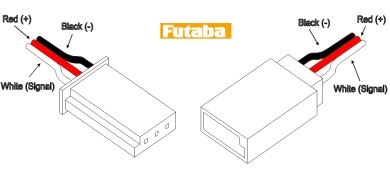
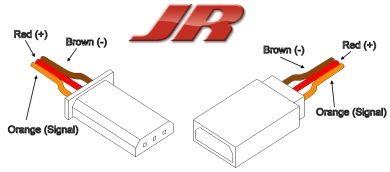
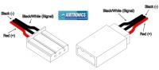
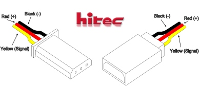
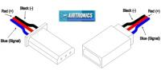
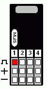

Hardware
========
Setting up the Autopilot
************************

Installing the Bootloader
-------------------------
- Install lcp21isp (this can be done via synaptic)
- Connect a 3.3v compatible FTDI serial dongle to the TX0 and RX0 lines on the GPS or UART0 connector
- Ground BOOT/SDA_1 pin (ie short together pins 1 and 7 on the GPS connector) and power up the board
- From the rocket directory, execute the command

::

    make install_bootloader

Programming the Autopilot (Using the Command Line)
---------------------------------------------------
- Plug a mini USB cable into the motherboard and computer (if you’re using a virtual box, connect the “USB bootloader” to the virtual box)
- Power up the motherboard (8V seems to be fine, but can go up to 18V)
- cd into the sw/onboard directory
- Execute the command

::

    make upload

Programming the Autopilot (Using the Groundstation)
---------------------------------------------------
- Plug a mini USB cable into the motherboard and computer (if you’re using a virtual box, connect the “USB bootloader” to the virtual box)
- Power up the motherboard (8V seems to be fine, but can go up to 18V)
- Select *UAV -> Program Autopilot*

Calibrating the Radio
---------------------
- From the groundstation, select *UAV -> Calibrate Radio*
- Move all the transmitter sticks. You should see values change.
- Fill out *Name* and *Min* , *Center* , *Max* for each channel. Note that Min represents the functional min value (i.e. zero throttle, left bank) and can be numerically greater than max depending on the transmitter.
- If the channel is a switch (and will be used for switching rather than control) then check the *Filtered* box.
- Click save, which will generate a file at *~/Desktop/radio.xml*
- Replace the radio.xml in sw/onboard/config.xml with the new one and reprogram the autopilot. This should then give you proper channel mappings.

Connecting the Autopilot
************************

