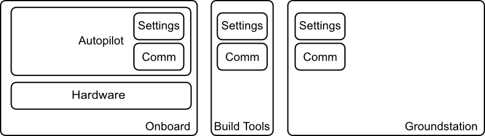
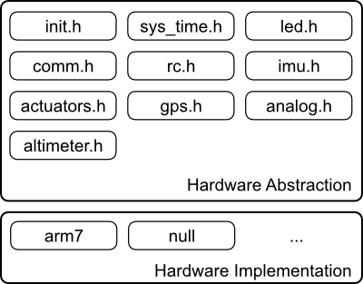
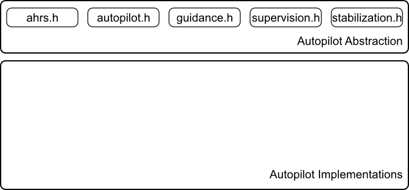

==============
Architecture
==============

Wasp has a hardware abstraction layer which isolates the software from the 
hardware implementing the defined interfaces. For a minimal HAL implementation
please study null.c

