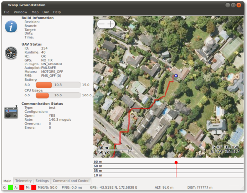
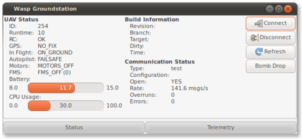

Groundstation
=============

The Wasp groundstation is the main point from which to configure, control
and test any UAV built using the Wasp framework. Once you have 
completed :ref:`groundstation-setup` the easiest way to start the groundstation
to explore its functionality is to execute the following command from the
groundstation directory (note: you do not need to have a UAV at this point)::

./groundstation -t

This launches the groundstation mode with a test (**-t**) data source.

You can also install the groundstation by typing::

make install-local

From the ``sw/groundstation/`` directory. This will allow launching the groundstation from
the menu of most linux computers.

Configuration
-------------

Configuration occurs via the ``File->Preferences`` menu item. Configuration values
are written to ``$HOME/.config/wasp/groundstation.ini``

Environment Variables
^^^^^^^^^^^^^^^^^^^^^

The following environment variables also influence the groundstation
display

:WASP_HOME_LAT:     The default latitude for the test data source
:WASP_HOME_LON:     The default longitude for the test data source
:WASP_IS_TESTING:   Sets additional debug/testing conditions in the groundstation

Extending the Groundstation
---------------------------

The groundstation has a powerful and easy to use API for writing 
plugins to extend its functionality. For a complete reference of the API
please see the following;

.. toctree::
   :maxdepth: 1

   groundstation-api

Example Groundstation Plugin
^^^^^^^^^^^^^^^^^^^^^^^^^^^^

Here is an example plugin which has its own user interface. It
contains a label which shows data received from the UAV, and a single button,
which when clicked sends a message to the UAV.

The plugin file (e.g. foo.py) should reside in the
**sw/groundstation/gs/plugins** directory

.. literalinclude:: /sw/groundstation/gs/plugins/example.py

Tablet UI
---------

There is a capable yet simple tablet focused UI for :xref:`wasp`. This uses
the same software as the desktop UI and has been tested on the following devices

* Nokia n800

Installing
^^^^^^^^^^

First install the dependencies

.. code-block:: bash

   sudo gainroot
   sudo apt-get install python2.5-gtk2 git-core wget

Now install and test the groundstation

.. code-block:: bash

   cd /home/user/
   git clone --recursive git://github.com/nzjrs/wasp.git
   cd wasp/sw/groundstation/
   ./tablet.py -t

This will check out all the groundstation code from git, and all submodules. Note;
unlike previous versions of this guide this includes a copy of ``python-serial``. 
This means you no longer have to install that package manually.

Now you need to install the appropriate kernel modules. 

.. code-block:: bash

   sudo gainroot
   wget https://github.com/nzjrs/wasp/raw/master/sw/groundstation/data/n800/ftdi_sio.ko -O /lib/ftdi_sio.ko
   wget https://github.com/nzjrs/wasp/raw/master/sw/groundstation/data/n800/usbserial.ko -O /lib/usbserial.ko
   wget https://github.com/nzjrs/wasp/raw/master/sw/groundstation/data/n800/usbserial -O /etc/init.d/usbserial
   chmod +x /etc/init.d/usbserial
   ln -s /etc/init.d/usbserial /etc/rc2.d/S99usbserial

Running
^^^^^^^

Running is a bit complicated because there is no serial port on the n800. You can connect a
XBEE modem into the USB port, but you must

* Power the XBEE externally (i.e. not from the USB port)
* Connect the XBEE into the n800 via a USB-OTG adapter

Once the hardware preparation has been made, and the sofware dependencies have
been installed, the following steps must be performed in this order

1. Plug in the OTG adapter, but do not connect the XBEE to it yet
2. Power on n800
3. Power on XBEE
4. Now plug the XBEE USB into the OTG adapter. There should be some activity on the screen (a USB logo may
   appear).
5. Check the serial port was created in a terminal

.. code-block:: bash

   ls /dev/ttyUSB*

6. If ``/dev/ttyUSB0`` is not listed in the output of #5 then type ``/sbin/lsmod`` to check if the kernel modules are present, you should see ftdi_sio and usbserial listed.
7. Start the tablet groundstation

.. code-block:: bash

   cd /home/user/wasp/sw/groundstation/
   ./tablet.py

